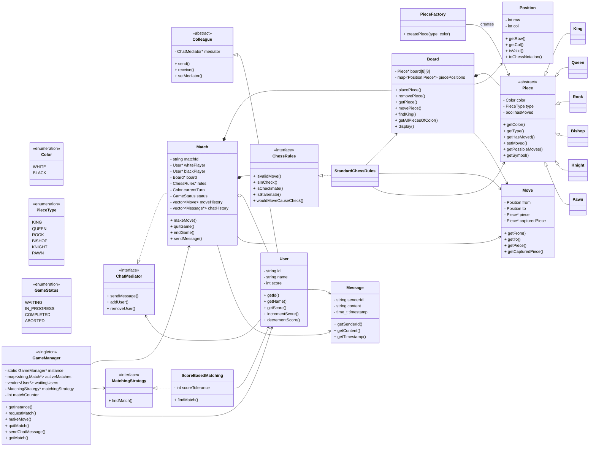

```mermaid
classDiagram
direction LR
    class Color {
	    WHITE
	    BLACK
    }

    class PieceType {
	    KING
	    QUEEN
	    ROOK
	    BISHOP
	    KNIGHT
	    PAWN
    }

    class GameStatus {
	    WAITING
	    IN_PROGRESS
	    COMPLETED
	    ABORTED
    }

    class Position {
	    - int row
	    - int col
	    + getRow()
	    + getCol()
	    + isValid()
	    + toChessNotation()
    }

    class Move {
	    - Position from
	    - Position to
	    - Piece* piece
	    - Piece* capturedPiece
	    + getFrom()
	    + getTo()
	    + getPiece()
	    + getCapturedPiece()
    }

    class Piece {
	    - Color color
	    - PieceType type
	    - bool hasMoved
	    + getColor()
	    + getType()
	    + getHasMoved()
	    + setMoved()
	    + getPossibleMoves()
	    + getSymbol()
    }

    class King {
    }

    class Queen {
    }

    class Rook {
    }

    class Bishop {
    }

    class Knight {
    }

    class Pawn {
    }

    class PieceFactory {
	    + createPiece(type, color)
    }

    class Board {
	    - Piece* board[8][8]
	    - map~Position,Piece*~ piecePositions
	    + placePiece()
	    + removePiece()
	    + getPiece()
	    + movePiece()
	    + findKing()
	    + getAllPiecesOfColor()
	    + display()
    }

    class ChessRules {
	    + isValidMove()
	    + isInCheck()
	    + isCheckmate()
	    + isStalemate()
	    + wouldMoveCauseCheck()
    }

    class StandardChessRules {
    }

    class Message {
	    - string senderId
	    - string content
	    - time_t timestamp
	    + getSenderId()
	    + getContent()
	    + getTimestamp()
    }

    class ChatMediator {
	    + sendMessage()
	    + addUser()
	    + removeUser()
    }

    class Colleague {
	    - ChatMediator* mediator
	    + send()
	    + receive()
	    + setMediator()
    }

    class User {
	    - string id
	    - string name
	    - int score
	    + getId()
	    + getName()
	    + getScore()
	    + incrementScore()
	    + decrementScore()
    }

    class Match {
	    - string matchId
	    - User* whitePlayer
	    - User* blackPlayer
	    - Board* board
	    - ChessRules* rules
	    - Color currentTurn
	    - GameStatus status
	    - vector~Move~ moveHistory
	    - vector~Message*~ chatHistory
	    + makeMove()
	    + quitGame()
	    + endGame()
	    + sendMessage()
    }

    class MatchingStrategy {
	    + findMatch()
    }

    class ScoreBasedMatching {
	    - int scoreTolerance
	    + findMatch()
    }

    class GameManager {
	    - static GameManager* instance
	    - map~string,Match*~ activeMatches
	    - vector~User*~ waitingUsers
	    - MatchingStrategy* matchingStrategy
	    - int matchCounter
	    + getInstance()
	    + requestMatch()
	    + makeMove()
	    + quitMatch()
	    + sendChatMessage()
	    + getMatch()
    }

	<<enumeration>> Color
	<<enumeration>> PieceType
	<<enumeration>> GameStatus
	<<abstract>> Piece
	<<interface>> ChessRules
	<<interface>> ChatMediator
	<<abstract>> Colleague
	<<interface>> MatchingStrategy
	<<singleton>> GameManager

    Piece <|-- King
    Piece <|-- Queen
    Piece <|-- Rook
    Piece <|-- Bishop
    Piece <|-- Knight
    Piece <|-- Pawn
    PieceFactory --> Piece : creates
    Board *-- Piece
    Board --> Position
    Board --> Move
    ChessRules <|.. StandardChessRules
    StandardChessRules --> Board
    StandardChessRules --> Move
    StandardChessRules --> Piece
    Colleague <|-- User
    ChatMediator <|.. Match
    User --> Message
    User --> ChatMediator
    Match *-- Board
    Match *-- ChessRules
    Match o-- User
    Match --> Move
    Match --> Message
    MatchingStrategy <|.. ScoreBasedMatching
    ScoreBasedMatching --> User
    GameManager --> Match
    GameManager --> MatchingStrategy
    GameManager --> User
```
