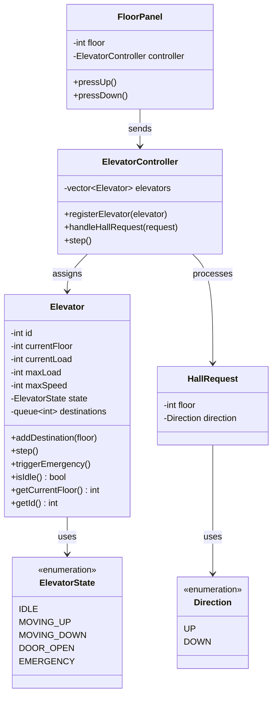

```mermaid
classDiagram
direction TB

    class Direction {
        <<enumeration>>
        UP
        DOWN
    }

    class ElevatorState {
        <<enumeration>>
        IDLE
        MOVING_UP
        MOVING_DOWN
        DOOR_OPEN
        EMERGENCY
    }

    class HallRequest {
        -int floor
        -Direction direction
    }

    class FloorPanel {
        -int floor
        -ElevatorController controller
        +pressUp()
        +pressDown()
    }

    class Elevator {
        -int id
        -int currentFloor
        -int currentLoad
        -int maxLoad
        -int maxSpeed
        -ElevatorState state
        -queue~int~ destinations
        +addDestination(floor)
        +step()
        +triggerEmergency()
        +isIdle() bool
        +getCurrentFloor() int
        +getId() int
    }

    class ElevatorController {
        -vector~Elevator~ elevators
        +registerElevator(elevator)
        +handleHallRequest(request)
        +step()
    }

    FloorPanel --> ElevatorController : sends
    ElevatorController --> Elevator : assigns
    ElevatorController --> HallRequest : processes
    Elevator --> ElevatorState : uses
    HallRequest --> Direction : uses
```
