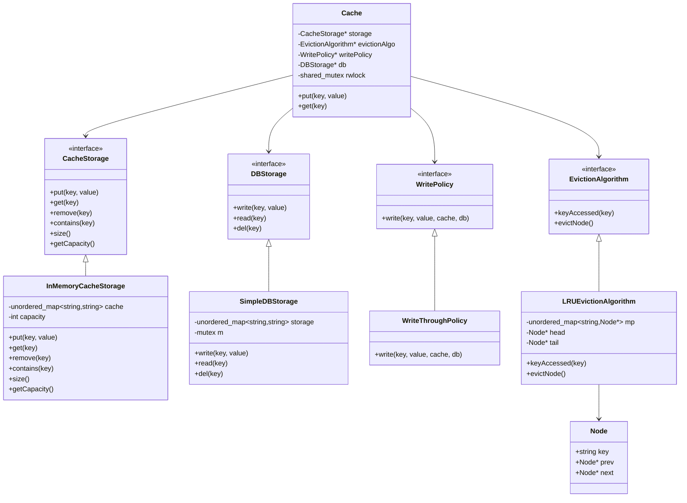

```mermaid
classDiagram

    class Cache {
        -CacheStorage* storage
        -EvictionAlgorithm* evictionAlgo
        -WritePolicy* writePolicy
        -DBStorage* db
        -shared_mutex rwlock
        +put(key, value)
        +get(key)
    }

    class CacheStorage {
        <<interface>>
        +put(key, value)
        +get(key)
        +remove(key)
        +contains(key)
        +size()
        +getCapacity()
    }

    class InMemoryCacheStorage {
        -unordered_map~string,string~ cache
        -int capacity
        +put(key, value)
        +get(key)
        +remove(key)
        +contains(key)
        +size()
        +getCapacity()
    }

    class DBStorage {
        <<interface>>
        +write(key, value)
        +read(key)
        +del(key)
    }

    class SimpleDBStorage {
        -unordered_map~string,string~ storage
        -mutex m
        +write(key, value)
        +read(key)
        +del(key)
    }

    class WritePolicy {
        <<interface>>
        +write(key, value, cache, db)
    }

    class WriteThroughPolicy {
        +write(key, value, cache, db)
    }

    class EvictionAlgorithm {
        <<interface>>
        +keyAccessed(key)
        +evictNode()
    }

    class LRUEvictionAlgorithm {
        -unordered_map~string,Node*~ mp
        -Node* head
        -Node* tail
        +keyAccessed(key)
        +evictNode()
    }

    class Node {
        +string key
        +Node* prev
        +Node* next
    }

    Cache --> CacheStorage
    Cache --> EvictionAlgorithm
    Cache --> WritePolicy
    Cache --> DBStorage

    CacheStorage <|-- InMemoryCacheStorage
    DBStorage <|-- SimpleDBStorage
    WritePolicy <|-- WriteThroughPolicy
    EvictionAlgorithm <|-- LRUEvictionAlgorithm

    LRUEvictionAlgorithm --> Node

```
