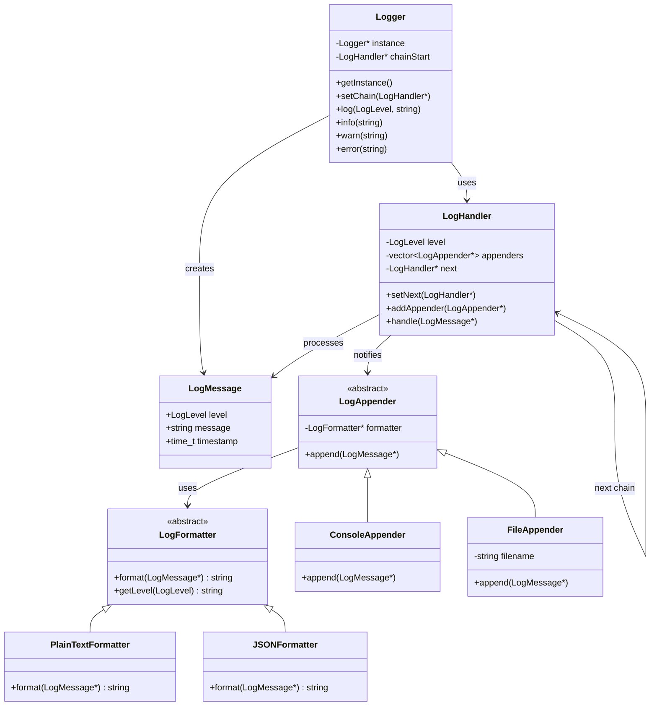

```mermaid
classDiagram

class Logger{
    -Logger* instance
    -LogHandler* chainStart
    +getInstance()
    +setChain(LogHandler*)
    +log(LogLevel, string)
    +info(string)
    +warn(string)
    +error(string)
}

class LogMessage{
    +LogLevel level
    +string message
    +time_t timestamp
}

class LogFormatter{
    <<abstract>>
    +format(LogMessage*) string
    +getLevel(LogLevel) string
}

class PlainTextFormatter{
    +format(LogMessage*) string
}

class JSONFormatter{
    +format(LogMessage*) string
}

class LogAppender{
    <<abstract>>
    -LogFormatter* formatter
    +append(LogMessage*)
}

class ConsoleAppender{
    +append(LogMessage*)
}

class FileAppender{
    -string filename
    +append(LogMessage*)
}

class LogHandler{
    -LogLevel level
    -vector~LogAppender*~ appenders
    -LogHandler* next
    +setNext(LogHandler*)
    +addAppender(LogAppender*)
    +handle(LogMessage*)
}

Logger --> LogHandler : uses
Logger --> LogMessage : creates

LogFormatter <|-- PlainTextFormatter
LogFormatter <|-- JSONFormatter

LogAppender <|-- ConsoleAppender
LogAppender <|-- FileAppender

LogAppender --> LogFormatter : uses

LogHandler --> LogAppender : notifies
LogHandler --> LogHandler : next chain
LogHandler --> LogMessage : processes

```
