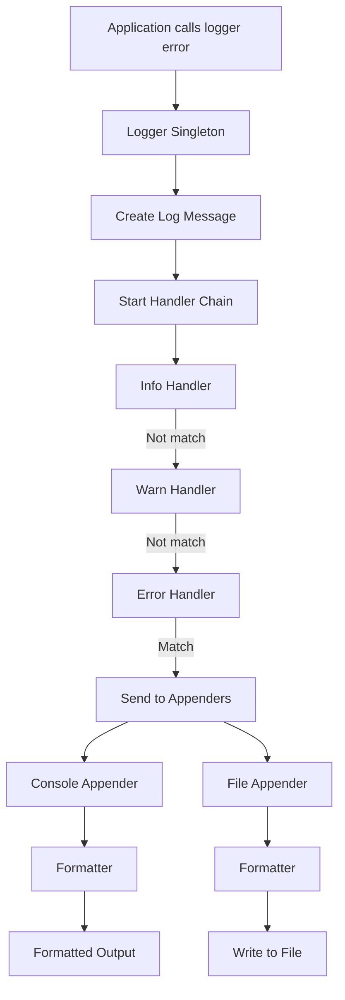

```mermaid
flowchart TB
    A["Application calls logger error"] --> B["Logger Singleton"]
    B --> C["Create Log Message"]
    C --> D["Start Handler Chain"]
    D --> E["Info Handler"]
    E -- Not match --> F["Warn Handler"]
    F -- Not match --> G["Error Handler"]
    G -- Match --> H["Send to Appenders"]
    H --> I["Console Appender"]
    H --> J["File Appender"]
    I --> K["Formatter"]
    J --> L["Formatter"]
    K --> M["Formatted Output"]
    L --> N["Write to File"]
```
