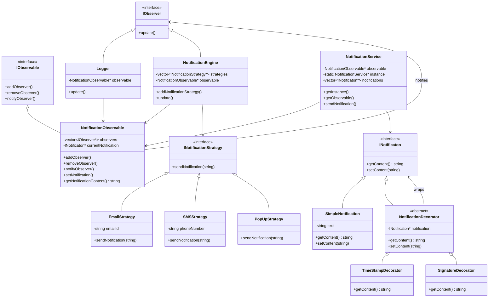

```mermaid
classDiagram

%% ======================
%% Notification Interface
%% ======================
class INotificaton{
    <<interface>>
    +getContent() string
    +setContent(string)
}

class SimpleNotification{
    -string text
    +getContent() string
    +setContent(string)
}

INotificaton <|-- SimpleNotification


%% ======================
%% Decorator Pattern
%% ======================
class NotificationDecorator{
    <<abstract>>
    -INotificaton* notification
    +getContent() string
    +setContent(string)
}

class TimeStampDecorator{
    +getContent() string
}

class SignatureDecorator{
    +getContent() string
}

INotificaton <|-- NotificationDecorator
NotificationDecorator <|-- TimeStampDecorator
NotificationDecorator <|-- SignatureDecorator
NotificationDecorator --> INotificaton : wraps


%% ======================
%% Observer Pattern
%% ======================
class IObserver{
    <<interface>>
    +update()
}

class IObservable{
    <<interface>>
    +addObserver()
    +removeObserver()
    +notifyObserver()
}

class NotificationObservable{
    -vector~IObserver*~ observers
    -INotificaton* currentNotification
    +addObserver()
    +removeObserver()
    +notifyObserver()
    +setNotification()
    +getNotificationContent() string
}

IObservable <|-- NotificationObservable
NotificationObservable --> IObserver : notifies


class Logger{
    -NotificationObservable* observable
    +update()
}

IObserver <|-- Logger
Logger --> NotificationObservable


%% ======================
%% Strategy Pattern
%% ======================
class INotificationStrategy{
    <<interface>>
    +sendNotification(string)
}

class EmailStrategy{
    -string emailId
    +sendNotification(string)
}

class SMSStrategy{
    -string phoneNumber
    +sendNotification(string)
}

class PopUpStrategy{
    +sendNotification(string)
}

INotificationStrategy <|-- EmailStrategy
INotificationStrategy <|-- SMSStrategy
INotificationStrategy <|-- PopUpStrategy


class NotificationEngine{
    -vector~INotificationStrategy*~ strategies
    -NotificationObservable* observable
    +addNotificationStrategy()
    +update()
}

IObserver <|-- NotificationEngine
NotificationEngine --> NotificationObservable
NotificationEngine --> INotificationStrategy


%% ======================
%% Singleton Service
%% ======================
class NotificationService{
    -NotificationObservable* observable
    -static NotificationService* instance
    -vector~INotificaton*~ notifications
    +getInstance()
    +getObservable()
    +sendNotification()
}

NotificationService --> NotificationObservable
NotificationService --> INotificaton
```
