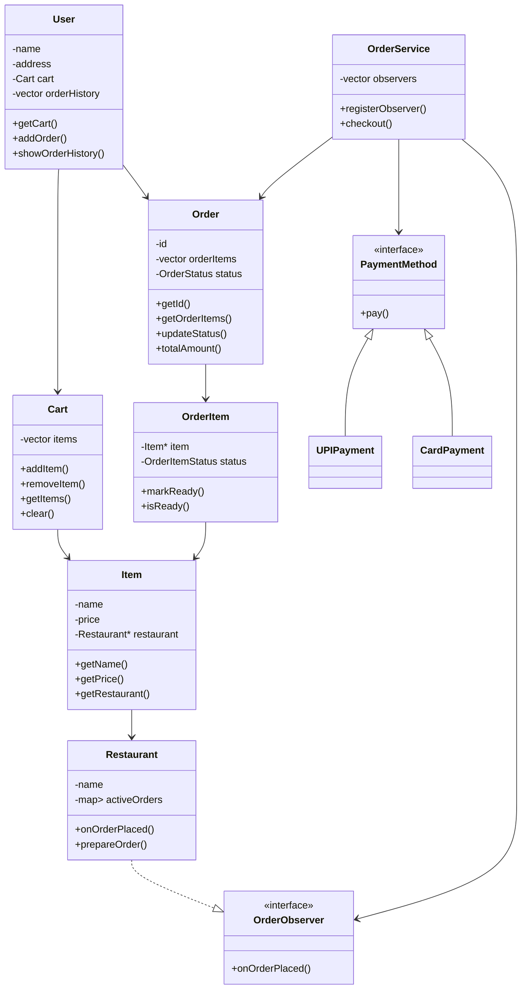

```mermaid

classDiagram

class User {
-name
-address
-Cart cart
-vector<Order\*> orderHistory
+getCart()
+addOrder()
+showOrderHistory()
}

class Cart {
-vector<Item\*> items
+addItem()
+removeItem()
+getItems()
+clear()
}

class Item {
-name
-price
-Restaurant\* restaurant
+getName()
+getPrice()
+getRestaurant()
}

class Order {
-id
-vector<OrderItem> orderItems
-OrderStatus status
+getId()
+getOrderItems()
+updateStatus()
+totalAmount()
}

class OrderItem {
-Item\* item
-OrderItemStatus status
+markReady()
+isReady()
}

class Restaurant {
-name
-map<int, vector<OrderItem\*>> activeOrders
+onOrderPlaced()
+prepareOrder()
}

class PaymentMethod {
<<interface>>
+pay()
}

class UPIPayment
class CardPayment

class OrderService {
-vector<OrderObserver\*> observers
+registerObserver()
+checkout()
}

class OrderObserver {
<<interface>>
+onOrderPlaced()
}

User --> Cart
User --> Order
Cart --> Item
Order --> OrderItem
OrderItem --> Item
Item --> Restaurant
OrderService --> Order
OrderService --> PaymentMethod
OrderService --> OrderObserver
Restaurant ..|> OrderObserver
PaymentMethod <|-- UPIPayment
PaymentMethod <|-- CardPayment

```
