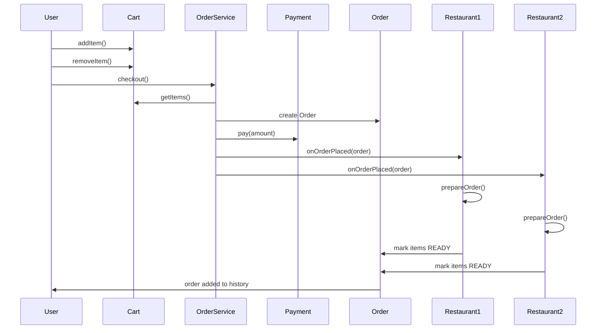

```mermaid
sequenceDiagram
participant User
participant Cart
participant OrderService
participant Payment
participant Order
participant Restaurant1
participant Restaurant2

User ->> Cart: addItem()
User ->> Cart: removeItem()
User ->> OrderService: checkout()
OrderService ->> Cart: getItems()
OrderService ->> Order: create Order
OrderService ->> Payment: pay(amount)

OrderService ->> Restaurant1: onOrderPlaced(order)
OrderService ->> Restaurant2: onOrderPlaced(order)

Restaurant1 ->> Restaurant1: prepareOrder()
Restaurant2 ->> Restaurant2: prepareOrder()

Restaurant1 ->> Order: mark items READY
Restaurant2 ->> Order: mark items READY

Order ->> User: order added to history


```
