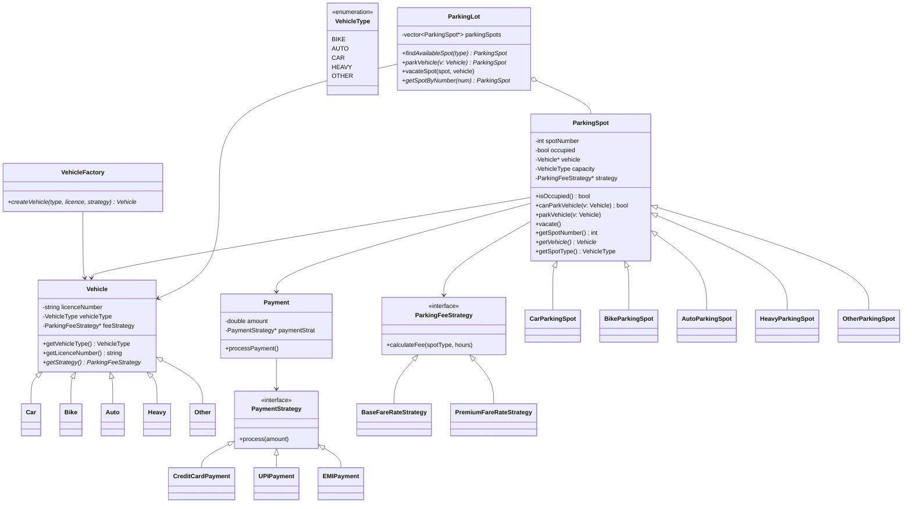

```mermaid
classDiagram

%% ================= ENUM =================
class VehicleType {
  <<enumeration>>
  BIKE
  AUTO
  CAR
  HEAVY
  OTHER
}

%% ================= VEHICLE =================
class Vehicle {
  -string licenceNumber
  -VehicleType vehicleType
  -ParkingFeeStrategy* feeStrategy
  +getVehicleType() VehicleType
  +getLicenceNumber() string
  +getStrategy() ParkingFeeStrategy*
}

class Car
class Bike
class Auto
class Heavy
class Other

Vehicle <|-- Car
Vehicle <|-- Bike
Vehicle <|-- Auto
Vehicle <|-- Heavy
Vehicle <|-- Other

%% ================= VEHICLE FACTORY =================
class VehicleFactory {
  +createVehicle(type, licence, strategy) Vehicle*
}

VehicleFactory --> Vehicle

%% ================= PAYMENT =================
class PaymentStrategy {
  <<interface>>
  +process(amount)
}

class CreditCardPayment
class UPIPayment
class EMIPayment

PaymentStrategy <|-- CreditCardPayment
PaymentStrategy <|-- UPIPayment
PaymentStrategy <|-- EMIPayment

class Payment {
  -double amount
  -PaymentStrategy* paymentStrat
  +processPayment()
}

Payment --> PaymentStrategy

%% ================= PARKING FEE STRATEGY =================
class ParkingFeeStrategy {
  <<interface>>
  +calculateFee(spotType, hours)
}

class BaseFareRateStrategy
class PremiumFareRateStrategy

ParkingFeeStrategy <|-- BaseFareRateStrategy
ParkingFeeStrategy <|-- PremiumFareRateStrategy

%% ================= PARKING SPOT =================
class ParkingSpot {
  -int spotNumber
  -bool occupied
  -Vehicle* vehicle
  -VehicleType capacity
  -ParkingFeeStrategy* strategy
  +isOccupied() bool
  +canParkVehicle(v: Vehicle) bool
  +parkVehicle(v: Vehicle)
  +vacate()
  +getSpotNumber() int
  +getVehicle() Vehicle*
  +getSpotType() VehicleType
}

class CarParkingSpot
class BikeParkingSpot
class AutoParkingSpot
class HeavyParkingSpot
class OtherParkingSpot

ParkingSpot <|-- CarParkingSpot
ParkingSpot <|-- BikeParkingSpot
ParkingSpot <|-- AutoParkingSpot
ParkingSpot <|-- HeavyParkingSpot
ParkingSpot <|-- OtherParkingSpot

ParkingSpot --> Vehicle
ParkingSpot --> ParkingFeeStrategy
ParkingSpot --> Payment

%% ================= PARKING LOT =================
class ParkingLot {
  -vector~ParkingSpot*~ parkingSpots
  +findAvailableSpot(type) ParkingSpot*
  +parkVehicle(v: Vehicle) ParkingSpot*
  +vacateSpot(spot, vehicle)
  +getSpotByNumber(num) ParkingSpot*
}

ParkingLot o-- ParkingSpot
ParkingLot --> Vehicle

```
