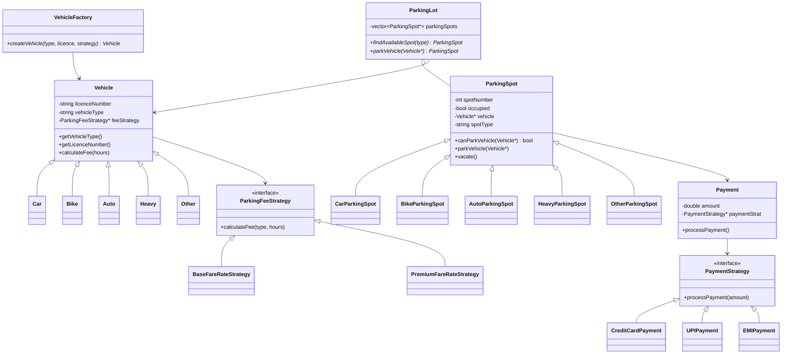

```mermaid
classDiagram

%% ================= Vehicle =================
class Vehicle {
  -string licenceNumber
  -string vehicleType
  -ParkingFeeStrategy* feeStrategy
  +getVehicleType()
  +getLicenceNumber()
  +calculateFee(hours)
}

class Car
class Bike
class Auto
class Heavy
class Other

Vehicle <|-- Car
Vehicle <|-- Bike
Vehicle <|-- Auto
Vehicle <|-- Heavy
Vehicle <|-- Other

class VehicleFactory {
  +createVehicle(type, licence, strategy) Vehicle*
}

VehicleFactory --> Vehicle

%% ================= Parking Spot =================
class ParkingSpot {
  -int spotNumber
  -bool occupied
  -Vehicle* vehicle
  -string spotType
  +canParkVehicle(Vehicle*) bool
  +parkVehicle(Vehicle*)
  +vacate()
}

class CarParkingSpot
class BikeParkingSpot
class AutoParkingSpot
class HeavyParkingSpot
class OtherParkingSpot

ParkingSpot <|-- CarParkingSpot
ParkingSpot <|-- BikeParkingSpot
ParkingSpot <|-- AutoParkingSpot
ParkingSpot <|-- HeavyParkingSpot
ParkingSpot <|-- OtherParkingSpot

%% ================= Parking Lot =================
class ParkingLot {
  -vector~ParkingSpot*~ parkingSpots
  +findAvailableSpot(type) ParkingSpot*
  +parkVehicle(Vehicle*) ParkingSpot*
}

ParkingLot o-- ParkingSpot
ParkingLot --> Vehicle

%% ================= Fee Strategy =================
class ParkingFeeStrategy {
  <<interface>>
  +calculateFee(type, hours)
}

class BaseFareRateStrategy
class PremiumFareRateStrategy

ParkingFeeStrategy <|-- BaseFareRateStrategy
ParkingFeeStrategy <|-- PremiumFareRateStrategy

Vehicle --> ParkingFeeStrategy

%% ================= Payment =================
class PaymentStrategy {
  <<interface>>
  +processPayment(amount)
}

class CreditCardPayment
class UPIPayment
class EMIPayment

PaymentStrategy <|-- CreditCardPayment
PaymentStrategy <|-- UPIPayment
PaymentStrategy <|-- EMIPayment

class Payment {
  -double amount
  -PaymentStrategy* paymentStrat
  +processPayment()
}

Payment --> PaymentStrategy
ParkingSpot --> Payment
```
