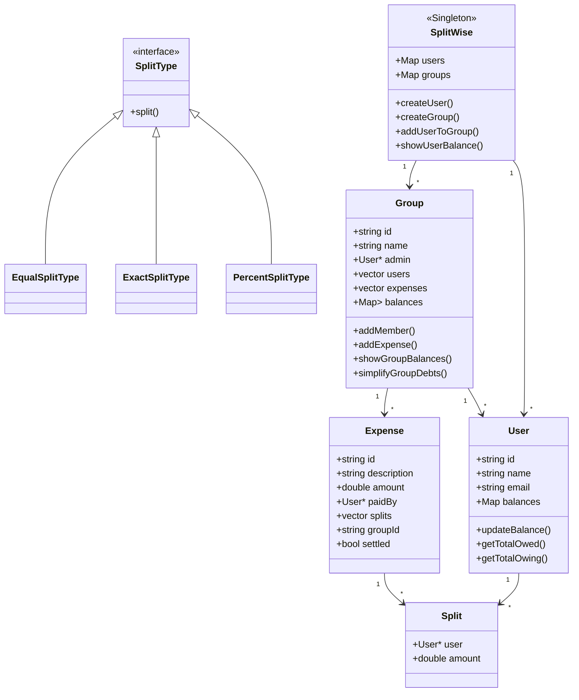

```mermaid
classDiagram

class User {
  +string id
  +string name
  +string email
  +Map<string,double> balances
  +updateBalance()
  +getTotalOwed()
  +getTotalOwing()
}

class Split {
  +User* user
  +double amount
}

class SplitType {
  <<interface>>
  +split()
}

class EqualSplitType
class ExactSplitType
class PercentSplitType

SplitType <|-- EqualSplitType
SplitType <|-- ExactSplitType
SplitType <|-- PercentSplitType

class Expense {
  +string id
  +string description
  +double amount
  +User* paidBy
  +vector<Split*> splits
  +string groupId
  +bool settled
}

class Group {
  +string id
  +string name
  +User* admin
  +vector<User*> users
  +vector<Expense*> expenses
  +Map<User*,Map<User*,double>> balances
  +addMember()
  +addExpense()
  +showGroupBalances()
  +simplifyGroupDebts()
}

class SplitWise {
  <<Singleton>>
  +Map<string,User*> users
  +Map<string,Group*> groups
  +createUser()
  +createGroup()
  +addUserToGroup()
  +showUserBalance()
}

User "1" --> "*" Split
Expense "1" --> "*" Split
Group "1" --> "*" Expense
Group "1" --> "*" User
SplitWise "1" --> "*" Group
SplitWise "1" --> "*" User

```
