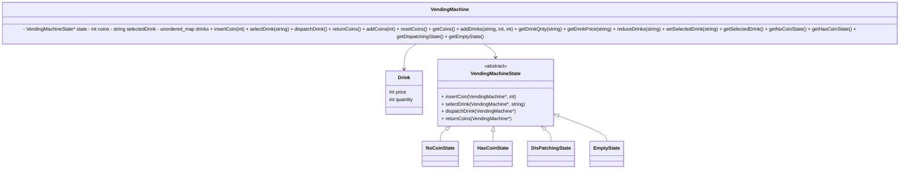

```mermaid
classDiagram
class VendingMachine { - VendingMachineState\* state - int coins - string selectedDrink - unordered_map<string, Drink> drinks + insertCoin(int) + selectDrink(string) + dispatchDrink() + returnCoins() + addCoins(int) + resetCoins() + getCoins() + addDrinks(string, int, int) + getDrinkQnty(string) + getDrinkPrice(string) + reduceDrinks(string) + setSelectedDrink(string) + getSelectedDrink() + getNoCoinState() + getHasCoinState() + getDispatchingState() + getEmptyState()
}

    class Drink {
        int price
        int quantity
    }

    class VendingMachineState {
        <<abstract>>
        + insertCoin(VendingMachine*, int)
        + selectDrink(VendingMachine*, string)
        + dispatchDrink(VendingMachine*)
        + returnCoins(VendingMachine*)
    }

    class NoCoinState
    class HasCoinState
    class DisPatchingState
    class EmptyState

    VendingMachineState <|-- NoCoinState
    VendingMachineState <|-- HasCoinState
    VendingMachineState <|-- DisPatchingState
    VendingMachineState <|-- EmptyState

    VendingMachine --> VendingMachineState
    VendingMachine --> Drink
```

```

```
